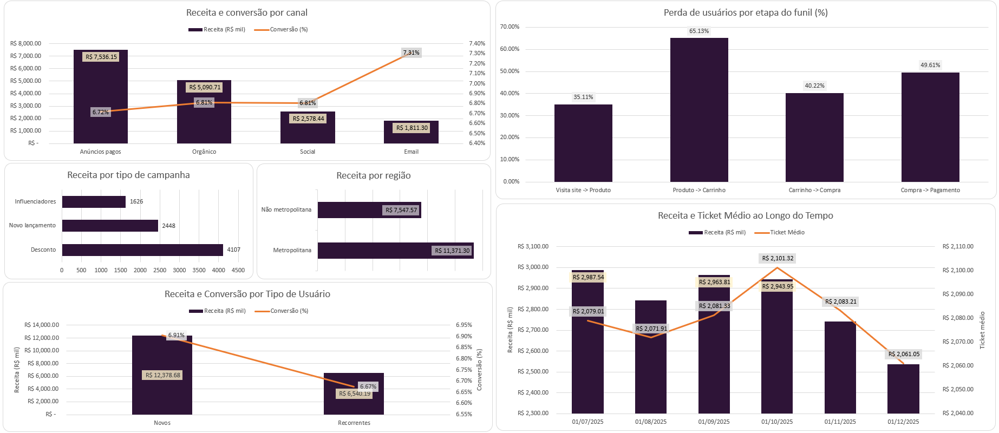
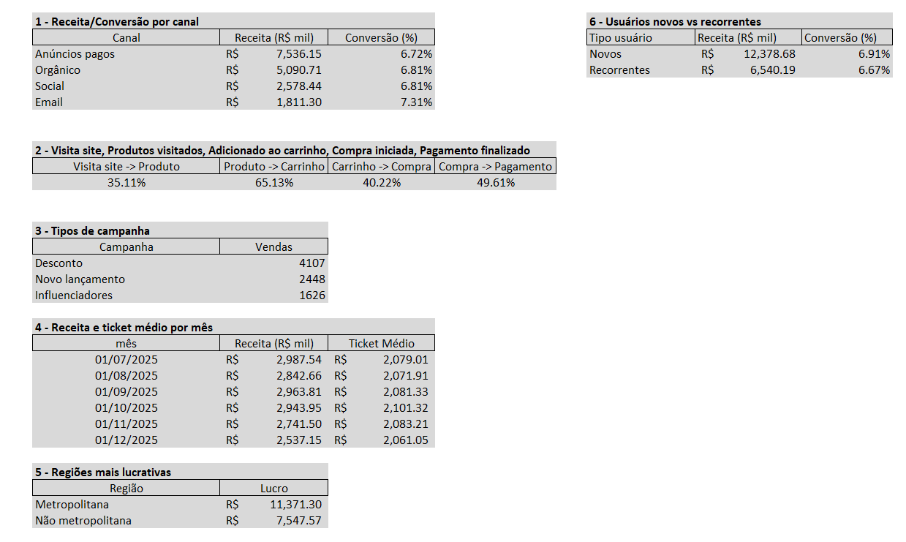
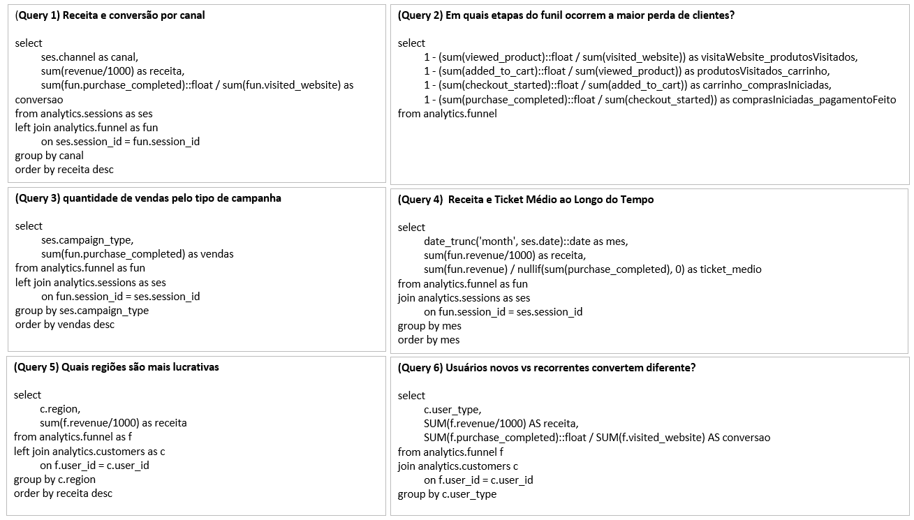

# 📊 Dashboard - E-commerce Funnel Analysis

## 🎯 Objetivo

Este dashboard foi desenvolvido no Excel com o objetivo de visualizar, de forma clara e interativa, as principais métricas de performance do funil de conversão do e-commerce.

---

## 📁 Estrutura da Planilha

A planilha está organizada em três abas principais:

### 📊 Dashboard

Contém os gráficos e visualizações principais:

* Taxa de conversão do funil
* Receita por canal
* Receita por região
* Comparação entre tipos de usuário
* Evolução temporal (receita e ticket médio)

👉 Esta aba é a principal interface de análise.

---

### 📈 Resultados

Contém os resultados das queries SQL utilizadas no projeto.

* Os dados são inseridos manualmente a partir do PostgreSQL
* Serve como base para alimentar os gráficos do dashboard
* Mantém a rastreabilidade entre dados e visualizações

---

### 🧾 Queries

Contém todas as queries SQL utilizadas para gerar as análises.

* Organizadas por tipo de análise (funil, performance, comportamento, etc.)
* Permite fácil reprodução dos resultados
* Funciona como documentação do processo analítico

---

## 🔄 Fluxo de Atualização

O funcionamento da planilha segue o seguinte fluxo:

1. Executar as queries no PostgreSQL
2. Copiar os resultados
3. Colar na aba **Resultados**
4. Os gráficos na aba **Dashboard** são atualizados automaticamente

---

## 🛠️ Ferramentas Utilizadas

* Excel
* PostgreSQL
* SQL

---

## 💡 Observações

* O dashboard foi projetado para ser simples e objetivo
* Focado em métricas de negócio e tomada de decisão
* Pode ser facilmente adaptado para outras bases de dados

---
